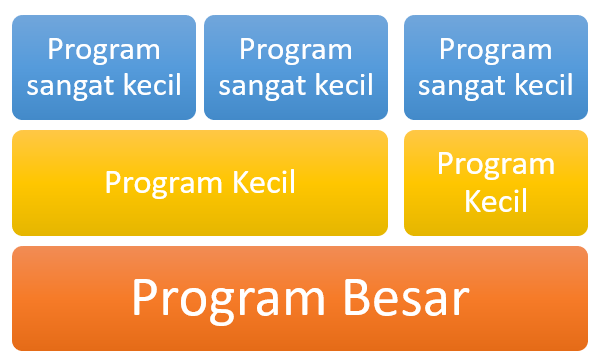
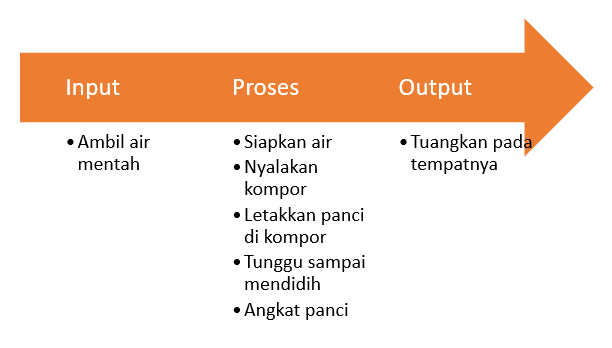
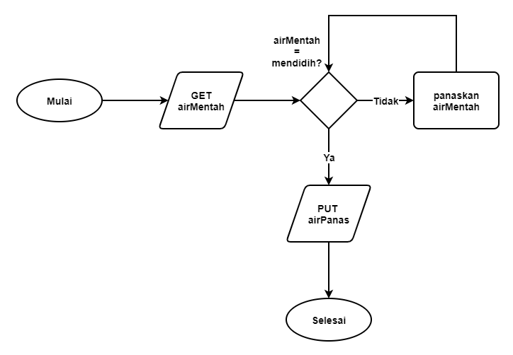
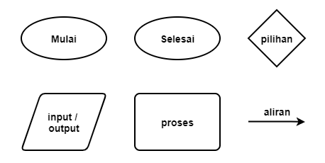

# Programming Fundamentals: Pemrograman Dasar

> Manusia dijadikan dengan sifatnya tergesa-gesa. Tapi itu bukan berarti bagus, harus diatasi.

Tidak perlu terburu-buru ingin menulis program. Ingat kembali proses SDLC yang sudah kita jelaskan sebelumnya. Sebelum kita benar-benar membuat kode program, ada beberapa tahapan yang harus kita pahami terlebih dahulu. Begitu juga dengan menulis program. Lakukan persiapan!

Apakah anda mau menulis program dan mempelajari cara menulis program tanpa tahu ternyata ada strategi mudahnya? Apakah anda mau belajar sekian lama, menulis kode program sekian banyak, tapi tetap tidak ketemu pola dasar dari sebuah program yang ternyata sederhana? Tentu tidak, kan?

Ada hal yang harus anda pahami dan ini tidak sulit untuk dipahami. Hanya saja ketika anda tidak tahu, anda akan seperti kebingungan sendiri pada saat mencoba menulis kode program.

Apa itu strateginya? Pahami struktur dasar sebuah program!

## Struktur Dasar Sebuah Program

Sebuah program adalah kumpulan sebuah proses-proses kecil yang dilakukan oleh program tersebut. Beruntungnya, proses-proses kecil itu bisa jadi adalah sebuah program juga yang fungsinya lebih kecil dari program tadi. Coba perhatikan ilustrasi berikut!



Dari ilustrasi di atas, kita bisa pahami bahwa, sebuah program adalah kumpulan program-program yang lebih kecil, dan program yang lebih kecil adalah kumpulan program-program yang jauh lebih kecil lagi. 

Konsep ini juga berlaku ke atas. Ketika program besar tersebut digabungkan dengan program besar lainnya, maka dia akan menjadi sebuah program raksasa. 

Dengan demikian, mempelajari bagaimana membuat program yang sangat kecil, akan sangat membantu kita untuk bisa dan terbiasa membuat program yang jauh lebih besar.

Silakan kita memulai membuat program-program yang kecil, kemudian kita kumpulkan program-program tersebut dan digabungkan menjadi program yang lebih besar. Secara bertahap, program kita akan menjadi semakin lengkap dan semakin layak untuk dijual ke pasaran. Gimana? Masuk akal kan?

Itulah mengapa kita sangat disarankan untuk mulai belajar dari contoh-contoh yang sederhana. Kemudian berangsur-angsur semakin panjang dan semakin besar, bukan berarti kita akan semakin repot. Justru tetap semakin mudah. Karena program-program kecil tadi sudah jauh-jauh hari sudah kita buat. Hanya tinggal menggabungkan saja dengan program kecil lainnya.

### Isi Sebuah Program

Sebuah program sebenarnya memiliki pola yang sama. Baik program kecil maupun program skala besar. Apa itu?


Ya, sebuah program biasanya terdiri dari input, proses dan output. Konsep ini harus benar-benar kita pahami terlebih dahulu.

1. Input, data yang dibutuhkan untuk diproses.
2. Proses, melakukan kalkulasi atau memilih hasil.
3. Ouput, data yang dihasilkan dari proses.

Tidak perlu terlalu dihapalkan definisinya. Yuk kita coba praktekkan!

**Contoh kasus #1: Program memasak air**

Inputnya adalah **air mentah**, sedangkan prosesnya adalah **memanaskan air** dengan api. Outputnya adalah air yang sudah dimasak, atau **air panas**.

Ilustrasi ini menunjukkan konsep tentang input, proses dan output. Dalam kasus di atas, air mentah menjadi input pada program yang akan kita buat. Trus, apakah boleh air masak menjadi input? 

Naah, bukan masalah boleh atau tidak yang harus kita pahami. Tapi masalah siapakah yang punya ide seperti itu 😁. Setiap programmer bebas mempunyai ide apa saja. Mungkin di satu sisi bisa jadi kurang tepat, tapi di sisi lain belum tentu. Semua kembali kepada permasalahan yang terjadi.

Yang perlu kita ingat adalah, program yang kita buat bisa jadi digunakan oleh orang lain yang lebih awam atau yang lebih mengerti tentang program. Jadi menentukan input harus benar-benar dipertimbangkan.

Pada proses, program akan melakukan pemanasan terhadap air terus menerus sampai mencapai suhu 100 derajat celcius. Ketika suhu sudah mencapai 100 derajat celcius, maka program akan otomatis berhenti dan menghasilkan output.

Disana ada tahapan kalkulasi, yaitu melakukan kalkulasi suhu air. Setiap beberapa saat suhu air diukur. Disana juga ada proses memilih, yaitu ketika air sudah mencapai suhu 100 derajat celcius maka program akan memilih untuk berhenti memanaskan dan mengeluarkan hasilnya.

**Contoh kasus #2: Program menghitung luas tanah**

Inputnya adalah **panjang tanah, dan lebar tanah**. Prosesnya adalah menghitung **perkalian panjang tanah dengan lebar** tanah. Sedangkan outputnya adalah **hasil perkalian** antara panjang dan lebar tanah.

Pada ilustrasi di atas, input dari program ada 2 (dua) yaitu panjang dan lebar tanah. Ini menunjukkan kalo input itu tidak terbatas hanya 1 (satu) saja. Sedangkan proses hanya perhitungan sederhana saja. Begitu juga outputnya.

| Kasus                 | Input                          | Proses           | Output          |
| --------------------- | ------------------------------ | ---------------- | --------------- |
| Memasak air           | air mentah                     | memanaskan air   | air panas       |
| Menghitung luas tanah | panjang tanah<br />lebar tanah | hitung perkalian | hasil perkalian |

Dengan melihat tabel di atas kita bisa mengetahui struktur dasar dari program yang sudah kita contohkan.

### Latihan

Perhatikan kasus-kasus berikut ini, kemudian buatlah tabel yang menentukan input, proses dan output dari masing-masing kasus.

1. Program menghitung luas lingkaran
2. Program kasir supermarket
3. Program mencari angka terbesar
4. Program menghitung umur berdasarkan wajah
5. Program melacak kiriman paket
6. Program menonton film

## Algoritma (Algorithm)

Sederhananya, algoritma adalah langkah-langkah, tahapan yang dilakukan oleh program. Algoritma dasar dari sebuah program adalah strukturnya. Perhatikan algoritma berikut!

1. Ambil data input
2. Lakukan proses pada data input
3. Keluarkan hasil proses (output)

Apapun program yang kita buat, algoritma dasarnya adalah seperti di atas. Inilah sebabnya kita perlu paham tentang algoritma dan struktur dasar sebuah program.

**Contoh kasus #1: Algoritma program memasak air**

Berikut adalah algoritmanya:

1. Ambil air mentah (input)
2. Siapkan air pada panci (proses)
3. Nyalakan kompor (proses)
4. Letakkan panci berisi air mentah di atas kompor yang sudah dinyalakan tadi (proses)
5. Tunggu sampai air mendidih atau suhu sampai 100 derajat celcius (proses)
6. Jika air sudah mendidih atau suhu mencapai 100 derajat celcius, maka matikan kompor (proses)
7. Angkat panci dan tuangkan air mendidih pada tempat yang disediakan (output)

Perhatikan kembali algoritma di atas. Algoritma tersebut sebenarnya hanya rincian dari input, proses dan output saja. Algoritma tersebut urutan sebenarnya adalah input, proses dan output.



Nah, dengan demikian, kita sudah dapat simpulkan kalo setiap program yang akan kita buat, pastilah akan menggunakan pola algoritma dan struktur dasar input, proses dan output.

### Latihan

Perhatikan kasus-kasus berikut ini! Kemudian buatlah algoritma dari masing-masing program berikut mengikuti pola input, proses dan output.

1. Program menghitung luas lingkaran
2. Program kasir supermarket
3. Program mencari angka terbesar
4. Program menghitung umur berdasarkan wajah
5. Program melacak kiriman paket
6. Program menonton film

## Notasi Algoritma

Begitu kita selesai membuat sebuah algoritma, maka algoritma itu dapat dijadikan kode program yang siap untuk dijalankan. Apakah kode program tersebut dikerjakan sendiri atau dikerjakan bersama-sama, pada akhirnya kita akan mendapatkan aplikasi yang siap digunakan.

Yang menjadi tantangan adalah ketika algoritma yang kita buat sebelumnya harus dikomunikasikan kepada orang lain atau programmer lain. Saat kita gunakan kalimat "Ambil air mentah", maka setiap programmer bakal memiliki pemahaman yang berbeda-beda. Apakah "air mentah diambil menggunakan alat", atau "air mentah diambil dari keran", atau seperti apa?

Membuat kalimat dan bahasa algoritma yang tidak spesifik dan tidak standar, mengakibatkan kesalahan pemahaman antara programmer satu dengan programmer lainnya. Untuk itu perlu ada notasi algoritma atau bahasa algoritma yang standar yang bisa dimengerti oleh semua programmer.

Saat ini sangat banyak sekali notasi yang bisa digunakan untuk merepresentasikan sebuah algoritma atau proses. Pada materi ini kita akan mengetahui beberapa di antaranya, yaitu:

1. Semikode (Pseudocode)
2. Diagram Alir (Flowchart)

Pada subbab berikutnya akan kita jelaskan satu persatu.

## Semikode (Pseudocode)

Semikode atau pseudocode adalah salah satu notasi algoritma berbentuk teks. Perhatikan contoh pseudocode berikut!

```
# Pseudocode memanaskan air
get air
get kompor
kompor.nyalakan()
kompor.setPanci()
while air.suhu < 100
	kompor.panaskan(air)
return air
```

Contoh pseudocode di atas adalah algoritma memanaskan air. Cara penulisan pseudocode juga menyerupai bentuk kode program (source code). Namun pseudocode tidak dapat dieksekusi secara langsung. Karena pseudocode digunakan hanya untuk mengkomunikasikan algoritma.

Pseudocode juga bisa dibuat dalam bahasa Indonesia, bebas aja. Namun pastikan orang lain mengerti dengan maksud pseudocode yang kita buat. Hindari penggunaan istilah yang tidak umum, sehingga orang lain tidak bingung ketika membaca pseudocode dari kita.

### Latihan

Perhatikan kasus-kasus berikut ini! Kemudian buatlah pseudocode dari masing-masing program berikut.

1. Program menghitung luas lingkaran
2. Program kasir supermarket
3. Program mencari angka terbesar
4. Program menghitung umur berdasarkan wajah
5. Program melacak kiriman paket
6. Program menonton film

## Diagram Alir (Flowchart)

Notasi algoritma lainnya adalah diagram alir (flowchart). Flowchart adalah salah satu notasi dalam bentuk diagram atau simbol. Perhatikan diagram berikut!



Diagram di atas menunjukkan proses memanaskan air mentah menjadi air panas. Notasi flowchart lebih mudah dipahami oleh orang umum karena berbentuk simbol. Aliran proses juga jelas dari mana dan ke mana. 

Untuk membuat sebuah flowchart, kita juga harus mengetahui simbol-simbol dasar yang digunakan pada flowchart. Penggunaan simbol yang salah akan menyebabkan orang lain menjadi tidak mengerti dengan algoritma yang kita buat.



Selain keenam simbol di atas, masih ada beberapa simbol lainnya yang juga ada pada flowchart. Namun, untuk tahapan ini kita cukup mengetahui keenam simbol di atas. 

### Latihan

Perhatikan kasus-kasus berikut ini! Kemudian buatlah diagram alir (flowchart) dari masing-masing program berikut.

1. Program menghitung luas lingkaran
2. Program kasir supermarket
3. Program mencari angka terbesar
4. Program menghitung umur berdasarkan wajah
5. Program melacak kiriman paket
6. Program menonton film

## Kode Program (Source Code)

Kode program (source code) inilah bentuk nyata dari algoritma-algoritma yang sudah kita buat sebelumnya. Dikatakan bentuk nyata karena hanya kode program ini saja yang dapat dieksekusi dan dibuktikan kebenarannya. 

Kode program bisa saja menjadi lebih panjang dari algoritmanya, biasanya disebabkan karena ketentuan masing-masing bahasa program yang digunakan. 

Untuk saat ini kita tidak bisa memberikan kode program untuk contoh kasus #1 memasak air. Ya karena algoritma tersebut tidak didukung oleh bahasa pemrograman, khususnya Java. Tetapi jika memang dipaksakan menjadi sebuah kode program, maka setidaknya contoh kode program berikut ini bisa mewakili.

```java
public class MemasakAir {
    public static void main(String[] args) {
        Air x = Air.getMentah();
        while( x.suhu < 100 ) {
            Air.panaskan(x);
        }
        System.out.println(x.toString());
    }
}
```

Terlepas dari contoh di atas, yang bisa kita pahami bahwa dalam dunia pemrograman, membuat kode program bukanlah satu-satunya keahlian yang harus dimiliki oleh seorang programmer. 

Pengetahuan tentang struktur dasar sebuah program merupakan hal dasar yang harus dipahami. Kemudian mengembangkan struktur dasar tersebut menjadi sebuah algoritma juga merupakan skill yang memang harus dikuasai oleh seorang programmer. Terakhir, menuangkan algoritma yang dibuat menjadi ke dalam bentuk notasi algoritma juga merupakan hal yang wajib diketahui oleh programmer. Karena kesemuanya itu merupakan langkah-langkah kita dalam membuat sebuah program menggunakan bahasa pemrograman.

Jadi, langkah praktis dalam mengkoding sebuah program bisa menggunakan langkah-langkah berikut:

1. Dimulai dari struktur dasar (input, proses dan output)
2. Kembangkan struktur dasar menjadi algoritma sesuai dengan kasusnya
3. Salin algoritma tersebut ke dalam bentuk notasi algoritma yang benar

Dengan demikian kita sudah siap untuk menjadikan algoritma tersebut menjadi sebuah kode program yang bisa dieksekusi.

## Tugas

Tugas kali ini kita akan membuat program menghitung selisih umur di antara 2 orang. Tentukan input, proses dan output dari program tersebut. Kemudian buatlah algoritmanya menggunakan pseudocode dan flowchart.